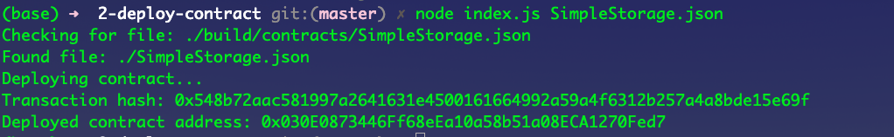

# Gitcoin: 2) Deploy A Simple Ethereum Smart Contract On Polyjuice

## 1. Screenshot of the console output

## 2. Transaction hash from the contract deployment

0x548b72aac581997a2641631e4500161664992a59a4f6312b257a4a8bde15e69f

## 3. Deployed contract address

0x030E0873446Ff68eEa10a58b51a08ECA1270Fed7